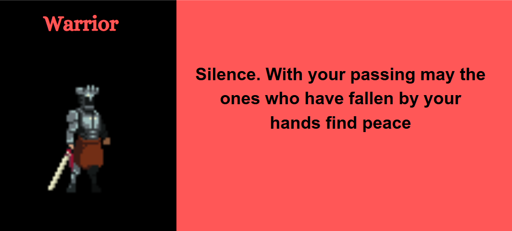

# The Survivor

## Summary

A monster has ravaged an entire village and has returned to its lair. The main character of the game is a skilled warrior in the village and is now the only survivor. Overcome with hatred and anger, the warrior embarks on a journey to defeat the monster. However the monster's lair is far out into the woods with many obstacles and treacherous terrain that makes reaching the lair very tough. The game is our unique twist on the classic side scroller runner games like the chrome dinosaur game. However instead of making an infinite scroller we want to make it finite. Once you reach a certain point you will encounter the boss lair and the boss that you must defeat. 

## Project Resources

[Web-playable version of your game.](https://itch.io/)  
[Trailor](https://drive.google.com/file/d/1nz8gQj3QAfBOyUSO9GFB3DCOwhOwAQbL/view?usp=share_link)  
[Press Kit](https://drive.google.com/file/d/1A7qypg9B-_LtcjDua6I-l1hZz8J_QjME/view?usp=share_link)  
[Proposal](https://docs.google.com/document/d/18Ft38fHuR5aqoiyBDuxAolDGG-6qYme-iuhNBJW0NP8/edit?usp=sharing)  

## Gameplay Explanation

This game is sort of like the chrome dino scroller game except its finite. Once reach a certain point you will encounter the demon. Your movement controls are jump, run, slide, and attack. You must use these controls to avoid the obstacles on your way to the demon. You must use your sword to defeat the demon.

# External Code, Ideas, and Structure

If your project contains code that: 1) your team did not write, and 2) does not fit cleanly into a role, please document it in this section. Please include the author of the code, where to find the code, and note which scripts, folders, or other files that comprise the external contribution. Additionally, include the license for the external code that permits you to use it. You do not need to include the license for code provided by the instruction team.

If you used tutorials or other intellectual guidance to create aspects of your project, include reference to that information as well.

# Main Roles

Your goal is to relate the work of your role and sub-role in terms of the content of the course. Please look at the role sections below for specific instructions for each role.

Below is a template for you to highlight items of your work. These provide the evidence needed for your work to be evaluated. Try to have at least four such descriptions. They will be assessed on the quality of the underlying system and how they are linked to course content.

_Short Description_ - Long description of your work item that includes how it is relevant to topics discussed in class. [link to evidence in your repository](https://github.com/dr-jam/ECS189L/edit/project-description/ProjectDocumentTemplate.md)

Here is an example:  
_Procedural Terrain_ - The game's background consists of procedurally generated terrain produced with Perlin noise. The game can modify this terrain at run-time via a call to its script methods. The intent is to allow the player to modify the terrain. This system is based on the component design pattern and the procedural content generation portions of the course. [The PCG terrain generation script](https://github.com/dr-jam/CameraControlExercise/blob/513b927e87fc686fe627bf7d4ff6ff841cf34e9f/Obscura/Assets/Scripts/TerrainGenerator.cs#L6).

You should replay any **bold text** with your relevant information. Liberally use the template when necessary and appropriate.

## Producer
Name: Arian Walia
Email: aswalia@ucdavis.edu
Github: inspector2107
As the producer for our group I made the group discord server which was our main form of communication. I also dedicated certain channels for different aspects of development. In terms of meetings I had a server with polls on what days were the best to meet up/call. I also tried to give the group a timeline on how far we should have come come along in our project based on what day we were on. There were some disputes along the way but through some meetings and calss I managed to settle the creative differenced that our group was having. I also helped other group members with miscellaneous tasks reagrding the code.

## User Interface and Input

Name: Arjun Takhar 
Email: atakhar@ucdavis.edu
GitHub: Takhar42

For the user interface and input I was in charge of making sure that the player movement and actions were smooth. The movements and keys were mapped so there is easy use to the user. The input mapping was very simple and worked really well with the concept of the game.

**Add an entry for each platform or input style your project supports.**

## Movement/Physics
Name: Hamza Ahmed
Email: harhmed@ucdavis.edu
Github: hamzahmed1234

We used a lot of the default physics settings like gravity to implement the jump control. Jump is the up arrow control and plays a sound effect when pushed. When the player is not on the floor we also simulate falling behaviors. Horizontal movement is handled by the left and right arrow keys. In the idle state, velocity is set to 0. We also have our slide movement which has a separate hitbox corresponding to movement. The slide control will make the hitbox much smaller and the hitbox will go back to normal when the slide is complete. The slide bind is the down arrow key. The sword can damage the demon within its hitbox. The sword bind is the s key.

The boss movement is directly dependent on the player's location as seen in the boss.gd class. If the boss is to closs to the player than it will go into the idle state but can continue attacking. There is also an attack timer to make sure that the boss does not attack constantly. The boss alternates between walking, attacking, and stopping. 

## Animation and Visuals

**List your assets, including their sources and licenses.**

**Describe how your work intersects with game feel, graphic design, and world-building. Include your visual style guide if one exists.**

## Game Logic
*Name: Leo Ying*  
*Email: leoying@ucdavis.edu*  
*GitHub: [Leo-Ying314](https://github.com/Leo-Ying314)*  

As the main gameplay programmer for this project, my role extended beyond its intended purpose largely due to the incoordination that existed in our team due to a lack of inter-group (technical) experience. I took on synchronizing both the actual logic - in the form of code, GitHub branches, and merging processes - along with the scenes within the project in order to ensure that I had the agency to make the game functional.

For example, the project initially existed as one main scene, with all relevant nodes in the same tree. This made the overall structure quite convoluted and made it difficult to reference certain aspects of the project while writing code. As such, I spent time [separating each component](5ab4a84ba08eb98ecc37b91bfe1e1c23475af23d) into their respective scenes, setting up a much more readable foundation for the rest of our work. Additionally, I added all animations for the boss and ghost sprites.

### Code  
Most of the logic exists within three files: 
1. [world.gd](https://github.com/Takhar42/Final_GameSurvivor/blob/632d79f8eacc10005c37d3712beef4ec44fe9741/Scripts/world.gd)  
2. [player.gd](https://github.com/Takhar42/Final_GameSurvivor/blob/3fdfc5d0b117b410e3372ac5ec9689ad1d8f80a5/Scripts/player.gd)  
3. [boss.gd](https://github.com/Takhar42/Final_GameSurvivor/blob/2e6f65689f948d2bbdc783174d061095ff48714d/Scripts/boss.gd)  

Due to the relatively simple scope of our game, we did not follow any specific game pattern to define our code. We really only had 3-4 game states (namely: main menu, running, cutscenes, and boss-fight) and as such, had the leniency to be more flexible in terms of our coding style. 

The first script handles most of the state logic, where much of the assets needed for the game to function are referenced and defined. The second and third scripts deal with player controls/movement and boss mechanics respectively, where input mapping along with scheduling moves are utilized to create a sense of interaction between the two characters.

# Sub-Roles

## Audio

**List your assets, including their sources and licenses.**

**Describe the implementation of your audio system.**

**Document the sound style.**

## Gameplay Testing

**Add a link to the full results of your gameplay tests.**

**Summarize the key findings from your gameplay tests.**

## Narrative Design
Name: Hamza Ahmed
Email: harhmed@ucdavis.edu
Github: hamzahmed1234

I designed the overall story of the game and cutscenes. Designing each cutscene took a bit of time but overall I am very happy with the way they look. I think one of the hardest parts of implementing the cutscenes was making sure that they start at the right times. Getting all the cutscenes to work at the right time took extensive debugging. For the sake of simplicity, I added cutscenes in three core areas. These areas being the beginning of the game, when the boss is first encountered, and once the boss is defeated. I did this by making an ENUM of the three cutscene types I used a timer node to delay between each scene. 

## Press Kit and Trailer

Name: Arian Walia
Email: aswalia@ucdavis.edu
Github: inspector2107

In the trailer I tried to showcase our games best point which was the boss fight and in addition I also tried to make the trailer showcase the storyline of our game. For the presskit I tried to make it through presskit() but I ran into some issues with aking the server so I created one through canva and added the trailer along with a coule other important details about the game.
The presskit.mp4 and Survivor Trailer.mp4 are both attatched in the boss branch

## Game Feel and Polish
*Name: Leo Ying*  
*Email: leoying@ucdavis.edu*  
*GitHub: [Leo-Ying314](https://github.com/Leo-Ying314)*  

Game feel is an integral part of the playing experience in any game. It should be intuitive yet understandable, making the audience feel as though they were in the world themselves. As such, I spent some time making our project feel both good to play and experience.

A large part of our game environment exists as the parallax background, which serves to give the illusion that the player is indeed running through the forest. The positioning of the
 background was a crucial part of keeping the immersion, which is why I intentionally utilized scaling tools, along with image mirroring, to give the forest a continuous and incredibly unified look.
 

Additionally, I fidgeted around with the parameters to ensure that our game didn’t feel too easy or too difficult, which is often an important and even necessary consideration when making any game. One primary example of this is that I made the speed of the game, along with the number of obstacles generated, proportional to the time that the player has spent running in order to make the difficulty go up as the game progresses. This was a critical point to add so that the game didn’t feel stagnant as the player made their way to the inevitable boss fight.
